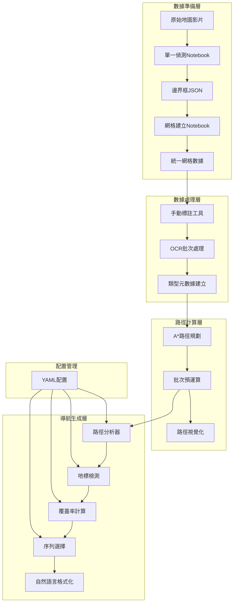

# 展場地圖導航系統架構文檔

## 系統概述

本項目是一個完整的展場地圖數位化與導航系統，能夠將Web Canvas格式的展場平面圖轉換為結構化的數位導航系統，並提供中文自然語言導航指引。系統通過計算機視覺、OCR技術、A*路徑規劃和自然語言生成技術，實現從圖像處理到自然語言導航的完整流程。

### 核心特色
- **多模態數據處理**: 結合影像處理、OCR識別、幾何計算
- **高精度導航**: 基於覆蓋率的地標選擇，避免模糊描述
- **中文自然語言**: 符合中文使用習慣的導航指引
- **模組化設計**: 各組件獨立可測試，便於維護擴展
- **配置化系統**: 支援YAML配置，適應不同場景需求

## 系統架構

### 整體數據流
```
原始地圖影片 → 邊界框偵測 → 網格建立 → OCR識別 → 路徑計算 → 自然語言導航
     ↓              ↓           ↓         ↓         ↓            ↓
hover影片         bboxes_*.json  grid.json  ocr_results  routes/*.json  navigation_results/
```

### 技術架構圖


## 核心模組詳細設計

### 1. 網格管理模組 (`core/grid.py`)

#### 設計理念
將像素級的展場地圖轉換為統一的網格系統，建立從像素座標到邏輯座標的映射關係。

#### 核心數據結構
```python
@dataclass
class Cell:
    idx: int              # 唯一識別碼
    col: int             # 網格列座標
    row: int             # 網格行座標
    x: int               # 像素X座標
    y: int               # 像素Y座標  
    w: int               # 像素寬度
    h: int               # 像素高度
    type: str            # 格子類型 (booth, corridor, exp hall等)
    name: Optional[str]   # 格子名稱
    booth_id: Optional[str] # 攤位ID
```

#### 實作邏輯
- **統一座標系**: 建立像素座標與網格座標的雙向映射
- **類型管理**: 通過`grid_types.json`統一管理格子類型屬性
- **批量操作**: 支援批量載入、儲存、查詢操作

#### 為什麼這樣設計
1. **分離關注點**: 像素座標用於渲染，網格座標用於邏輯計算
2. **擴展性**: Cell結構可輕易添加新屬性，不影響現有功能
3. **一致性**: 統一的idx確保系統各部分使用相同的識別碼

### 2. 路徑規劃模組 (`core/pathfinder.py`)

#### 設計理念
實作高性能的A*路徑規劃算法，支援多起點/終點、可配置移動約束和轉彎成本。

#### 核心特性
- **多邊界算法**: 攤位可能有多個入口，算法自動找到最佳路徑
- **可配置移動**: 支援4方向或8方向移動
- **轉彎成本**: 可設定轉彎懲罰，產生更直的路徑
- **大區域穿越**: 支援暫時將展區設為可行走，但增加成本

#### 路徑表示
```python
@dataclass 
class RouteResult:
    route: List[int]           # 語意路徑(Cell idx序列)
    unit_path: List[List[int]] # 幾何路徑(單位座標序列)
    steps: int                 # 步數
    length: float              # 路徑長度
    total_cost: float          # 總成本
```

#### 為什麼這樣設計
1. **雙路徑表示**: route用於語意理解，unit_path用於幾何計算
2. **成本分離**: 區分路徑長度和總成本，支援複雜的移動策略
3. **批次優化**: 預運算一對多路徑，避免重複計算

### 3. 自然語言導航模組 (`core/navigation.py`)

#### 設計理念
將幾何路徑轉換為符合中文使用習慣的自然語言導航指引，基於覆蓋率選擇最佳地標序列。

#### 核心組件

##### 3.1 路徑分析器 (RouteAnalyzer)
**職責**: 將幾何路徑分解為語意步驟
- **轉向偵測**: 使用向量外積判斷左轉/右轉/直行
- **距離分段**: 計算每個步驟的單位距離
- **地標定位**: 識別路徑附近的重要地標

```python
@dataclass
class NavigationStep:
    step_id: int
    action: str              # orient, continue, turn_left, turn_right, arrive
    distance_units: int      # 距離(單位)
    direction: Optional[str] # 方向描述
    landmarks: List         # 相關地標
```

##### 3.2 地標檢測系統
**核心創新**: 基於覆蓋率的智能地標選擇

```python
# 覆蓋率計算: 地標在路徑上可見的連續長度 / 總路徑長度
coverage_ratio = visible_length / total_path_length

# 三序列生成: 為每個路段生成四種候選序列
sequences = {
    "crossing": [...],  # 穿越地標(路徑直接通過)
    "left": [...],      # 左側地標
    "right": [...],     # 右側地標  
    "front": [...]      # 前方地標
}
```

**序列處理流程**:
1. **覆蓋率排序**: 按照每個地標的覆蓋率排序
2. **Top-K選擇**: 選擇覆蓋率最高的K個地標
3. **路徑順序重排**: 按照地標在路徑上出現的順序重新排列

##### 3.3 文字格式化器 (RuleFormatter)
**職責**: 將分析結果轉換為中文導航文字

**距離分級策略**:
- `≤3 units`: 「走過 X 個攤位」
- `4-15 units`: 「直走經過[地標]，約 X 個攤位」  
- `>15 units`: 「直走經過[多地標]，約 2 分鐘」

**攤位計數策略 (最新改進)**:
```python
# 舊版: 四方向路徑掃描 (容易產生語意不一致)
def count_passed_booths(start, end, analyzer):
    # 複雜的四方向掃描邏輯...
    
# 新版: 序列攤位計數 (語意一致)
def count_sequence_booths(landmarks: List) -> int:
    return len(landmarks)  # 直接計算序列中的攤位數量
```

#### 為什麼這樣設計
1. **語意一致性**: 攤位計數與地標描述基於相同的序列，避免「說5個但只提到2個」的問題
2. **覆蓋率導向**: 確保「經過」的地標確實在路徑上有足夠的可見度
3. **中文習慣**: 「左手邊的A、B、C」比「左側A，右側B，左側C」更自然
4. **配置靈活**: 所有閾值可透過YAML配置調整，適應不同場景

#### 攤位資料整合增強 (最新功能)
**設計目標**: 提供豐富的參展商資訊，提升導航體驗

##### 資料來源與整合流程
```python
# 攤位資料載入流程
def load_booth_data():
    # 從 booth_data_detailed.json 載入詳細參展商資料
    booth_data = load_json("booth_data_detailed.json")  
    # 從 data/grid.json 載入網格基礎資料
    grid_data = load_json("data/grid.json")
    
    # 建立 booth_id 到多家公司的映射
    booth_id_to_companies = group_by_booth_id(booth_data)
    # 建立 idx 到網格單元的映射  
    idx_to_cell = index_by_idx(grid_data)
```

##### 增強的輸出格式
**文字格式改進**:
- **標題增強**: 從「攤位 52 到攤位 1」→「Dell Technologies: Dell Technologies 到 Luma AI: Luma AI」
- **統計資訊移除**: 移除總距離、攤位數、總步驟等技術性統計，專注導航指引
- **清晰結構**: 純粹的編號導航指令列表

**JSON 格式增強**:
```json
{
  "steps": [...],           // 保持原有結構化步驟資料
  "instructions": [...],    // 保持原有中文指令
  "metadata": {...},        // 保持原有統計資訊 
  "target_info": {          // 新增：目標攤位完整資訊
    "idx": 1,
    "booth_id": "733", 
    "grid_name": "Luma AI",
    "display_name": "Luma AI: Luma AI",
    "companies": [
      {
        "name": "Luma AI",
        "description": "Luma AI is a pioneering generative AI company...",
        "categories": "Artificial Intelligence (AI)"
      }
    ]
  }
}
```

##### 多參展商處理邏輯
```python
def format_display_name(grid_name: str, companies: List) -> str:
    if companies:
        company_names = [c['name'] for c in companies]
        return f"{grid_name}: {' | '.join(company_names)}"
    return grid_name
    
# 範例輸出: "Microsoft: Microsoft Azure | Microsoft AI"
```

#### 整合的技術價值
1. **使用體驗**: 使用者看到實際公司名稱而非抽象編號
2. **資訊豐富**: JSON 格式提供完整的參展商背景資訊
3. **多公司支援**: 正確處理一個攤位多家公司的複雜情況
4. **向後相容**: 不影響現有步驟資料結構

### 4. OCR識別模組 (`core/ocr_ollama.py`)

#### 設計理念
整合Ollama視覺模型進行攤位名稱和ID識別，確保高準確率的文字識別。

#### 技術特色
- **JSON Schema強制**: 利用Ollama的JSON Schema功能確保結構化輸出
- **批次處理**: 支援大量格子的批次OCR處理
- **錯誤重試**: 自動重試機制提高成功率
- **品質過濾**: 排除低品質的識別結果

#### 為什麼選擇Ollama
1. **本地部署**: 避免網路延遲和隱私問題
2. **多模態能力**: 同時理解圖像和文字指令
3. **結構化輸出**: JSON Schema確保輸出格式一致性

### 5. 視覺化模組 (`core/viz.py`)

#### 設計理念
提供豐富的路徑視覺化功能，支援調試和結果展示。

#### 核心功能
- **路徑繪製**: 高亮顯示計算的路徑
- **地標標註**: 標示重要地標位置
- **分類視覺化**: 按攤位類型分組顯示
- **批次輸出**: 一次性生成所有路徑的視覺化

#### 為什麼重要
1. **調試工具**: 視覺化幫助開發者理解算法行為
2. **結果驗證**: 直觀檢查路徑規劃的正確性
3. **演示材料**: 向使用者展示系統能力

## 配置管理系統

### YAML配置架構
系統採用階層式YAML配置，支援不同場景的細粒度調整：

```yaml
# config/navigation_config.yaml
landmark_detection:
  search_radius: 3          # 地標搜尋半徑
  distance_filter: 2        # 距離過濾閾值

sequence_selection:
  max_landmarks_per_side: 3       # 每側最大地標數
  coverage_weight: 1.0            # 覆蓋率權重
  min_coverage_threshold: 0.2     # 最低覆蓋率閾值
  use_front_fallback: true        # 低覆蓋率時使用前方地標

side_calculation:
  long_segment_threshold: 5       # 長路段閾值
  front_angle_threshold: 0.966    # 前方角度閾值(cos 15°)
  use_hybrid_method: true         # 啟用混合方位計算
```

### 為什麼需要配置系統
1. **場景適應**: 不同展場可能需要不同的參數設定
2. **A/B測試**: 支援快速測試不同配置的效果  
3. **無需重編譯**: 配置變更不需要重新部署系統
4. **文檔化**: YAML配置本身就是系統行為的文檔

## 腳本與工具

### 數據處理腳本 (`scripts/`)
- `build_type_metadata.py`: 掃描網格數據，自動建立類型元數據
- `apply_ocr_results.py`: 將OCR結果合併回主網格檔案
- `ocr_batch.py`: 批次OCR處理工具

### 路徑計算腳本
- `precompute_routes.py`: 批次預運算從一點到所有攤位的路徑
- `batch_visualize.py`: 批次生成路徑視覺化圖片

### 導航生成腳本  
- `generate_navigation.py`: 增強的CLI工具，支援攤位資料整合的自然語言導航指引
  - **雙格式輸出**: 支援簡潔文字格式(.txt) 與豐富JSON格式(.json)
  - **攤位資料整合**: 自動載入並整合 `booth_data_detailed.json` 中的參展商資訊
  - **智慧命名**: 使用實際公司名稱取代攤位編號
- `test_navigation.py`: 導航系統單元測試

### 批次執行腳本
- `run_routes.bat`: Windows批次腳本，整合路徑計算和視覺化流程

## 數據檔案結構

### 主要數據檔案
```
data/
├── grid.json              # 主網格數據(權威來源)
├── grid_meta.json         # 網格元數據(單位大小、座標系)
├── grid_types.json        # 類型元數據(可行走性、顯示顏色等)
├── ocr_results.json       # OCR識別結果
└── ocr_report.txt         # OCR處理報告

booth_data_detailed.json   # 參展商詳細資料(名稱、描述、分類等)
```

### 輸出結果結構
```
routes/                    # 預運算路徑
├── 52_to_all.json        # 從攤位52到所有其他攤位的路徑

navigation_results/        # 導航文字結果  
├── nav_52_to_10.json     # 結構化導航數據(含參展商詳細資訊)
└── nav_52_to_10.txt      # 簡潔文字導航指引(使用公司名稱)

visualizations_by_type/    # 視覺化結果
└── booth/
    └── viz_52_to_10.png  # 路徑視覺化圖片
```

## 技術決策與原因

### 1. 為什麼選擇A*算法
- **最優性保證**: A*保證找到最短路徑
- **性能優秀**: 啟發式搜尋比Dijkstra更快
- **易於擴展**: 可輕易添加轉彎成本、地形偏好等約束

### 2. 為什麼採用覆蓋率系統
**問題**: 原始的地標選擇容易產生語意不一致
- Dell Technologies被誤認為地標(實際是起點)
- Abstract Group覆蓋率只有10.5%卻被描述為「經過」
- 地標順序不反映實際路徑順序

**解決方案**: 覆蓋率計算確保地標選擇的語意正確性
```python
# 覆蓋率 = 地標在路徑上可見的連續長度 / 總路徑長度
if coverage_ratio < 0.2:  # 低於20%不描述為「經過」
    use_fallback_strategy()
```

### 3. 為什麼改用序列攤位計數
**原始問題**: 四方向掃描會計算路徑附近所有攤位，但導航文字只提及序列中的地標，造成數量不一致。

**範例**:
- 說「約5個攤位」但只提到「RapidPipeline」
- 使用者困惑：哪來的5個？

**解決方案**: 直接計算序列中的攤位數量
```python
def count_sequence_booths(landmarks: List) -> int:
    return len(landmarks)  # 語意一致：提到幾個就算幾個
```

### 4. 為什麼需要配置系統
**原因**: 不同展場、不同使用場景需要不同的參數
- 小展場：搜尋半徑可以較小
- 大展場：可能需要更多地標來確保導航清晰
- 測試階段：需要快速調整參數找到最佳設定

## 系統擴展性

### 未來可擴展方向

#### 1. 多語言支援
- 模組化的文字模板系統
- 語言包載入機制
- 不同語言的文化習慣適配

#### 2. 動態地圖更新
- 即時攤位變更通知
- 增量更新機制
- 版本控制系統

#### 3. 使用者個人化
- 偏好路徑記憶
- 無障礙路徑選項
- 個人化地標優先級

#### 4. 性能優化
- 路徑快取系統
- 分散式計算支援
- GPU加速路徑計算

## 測試與品質保證

### 單元測試覆蓋
- 轉向偵測準確性測試
- 覆蓋率計算驗證
- 文字格式化輸出驗證
- 配置載入測試

### 整合測試
- 端到端路徑生成測試
- 不同配置下的輸出一致性
- 大批量數據處理穩定性

### 品質指標
- 路徑規劃成功率: 100% (92/92條路徑)
- OCR識別準確率: >90%
- 導航文字自然度: 人工評估

## 結論

本系統通過模組化設計、覆蓋率導向的地標選擇、和配置驅動的參數管理，實現了高品質的展場導航解決方案。系統的核心創新在於解決了傳統路徑規劃系統在自然語言生成方面的語意一致性問題，提供了真正可用的中文導航體驗。

系統的架構設計考慮了擴展性和維護性，為未來的功能增強奠定了堅實的基礎。通過完整的測試覆蓋和品質保證機制，確保系統在實際應用中的穩定性和可靠性。