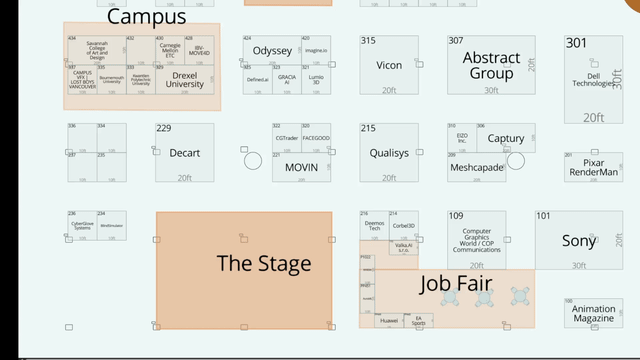

 # Exhibition Floor Plan Navigation Project

## 🎯 系統示範 | System Demonstration

### Navigation Example: From Booth 52 to Booth 1

**Visual Route Representation:**


**Generated Navigation Instructions (Chinese):**

```
=== 從攤位 52 到攤位 1 的導航指令 ===

總距離: 46.0 units
約等於: 18 個攤位
總步驟: 7

導航指令:
1. 面向Abstract Group攤位，準備出發。
2. 直走經過右手邊的XIMEA、XGRIDS、Connection Lounge，約 3 個攤位。
3. 走到Connection Lounge前右轉。
4. 直走經過左手邊的Odyssey，走至Bria Visual AI Platform前，約 2 個攤位。
5. 走到Bria Visual AI Platform前左轉。
6. 直走經過右手邊的SKY ENGINE AI。
7. 目的地就在前方的 Luma AI。
```

This example demonstrates:
- **Precise Path Visualization**: Clear route visualization with highlighted start/end points
- **Natural Language Instructions**: Human-readable Chinese navigation with landmark references
- **Semantic Consistency**: Booth count matches actual landmark descriptions (e.g., "約 3 個攤位" with 3 landmarks mentioned)
- **Spatial Awareness**: Accurate left/right/front directions based on movement analysis

---

This project aims to create a digital solution for exhibition floor plans, with the ultimate goal of providing text-based navigation from a specific starting point (e.g., Dell booth) to other booths or areas.

## Project Goals and Prerequisites

-   **Goal**: To build a digitized exhibition floor plan that provides text-based navigation between booths.
-   **Prerequisites**:
    -   The original floor plan (https://siggraph25.mapyourshow.com/8_0/exhview/index.cfm) is in web Canvas Render format, making direct extraction of booth information difficult.
    -   The map Canvas highlights booths on hover, a characteristic we leverage for detection.
    -   Booth layouts on the map are grid-aligned.
    -   Leverage Computer Vision (CV) and Optical Character Recognition (OCR) technologies to parse the map.

## ✨ Task Progress (TODOs)

-   [x] **Grid Creation & Management**: Convert the map into structured grid data (`data/grid.json`).
-   [x] **Manual Annotation Tool**: Provide a GUI tool (`core/annotate.py`) for manual addition, modification, and deletion of grid cells.
-   [x] **OCR Information Extraction**: Automatically identify booth names and IDs and populate them into the grid data.
-   [x] **Path Calculation**: Implement A* algorithm (`core/pathfinder.py`) & batch pre-compute script (`scripts/precompute_routes.py`).
-   [x] **Path Visualization**: New visualization module (`core/viz.py`) & helper scripts (`scripts/visualize_routes.py`, `scripts/batch_visualize.py`).
-   [x] **Text Navigation Generation**: Convert paths into natural language navigation instructions with coverage-based landmark selection and Chinese natural language generation.

> For detailed technical planning and historical progress, please refer to: [`task.md`](./task.md)

---

## 📸 Pre-processing Steps (Data Preparation)

Before starting grid creation, we need to obtain the raw booth data from the online map.

1.  **Record Online Map**: Record a video of the online map, hovering over all booths one by one to highlight them.
    > **Note**: The map might be too large, requiring multiple recordings to cover all areas.
    
    **Example Recording:**
    
    
    
    *Sample hover recording showing booth highlighting detection*

2.  **Process Individual Videos**: Use `notebooks/single_detect.ipynb` to process each recorded video, converting all highlighted booth areas into grid boxes on the large map, and saving the results as `bboxed_{i}.json`.
    ```
    notebooks/single_detect.ipynb
    ```

3.  **Merge and Calculate Grid Units**: Use `notebooks/01_build_grid.ipynb` to merge grid box data from multiple videos and calculate uniform grid units. This will generate `data/grid.json` as the primary grid data source.
    ```
    notebooks/01_build_grid.ipynb
    ```

4.  **Extract Booth Details (Optional)**: Extract additional exhibitor information from the online exhibition directory for enhanced navigation context.
    
    **Process:**
    1. Visit `https://siggraph25.mapyourshow.com/8_0/explore/exhibitor-gallery.cfm`
    2. Expand all exhibitors to show the complete list
    3. Save the HTML page as `booth.html`
    4. Run the booth detail extraction scripts:
    ```bash
    # Parse basic booth data from HTML
    python scripts/booth_detail/parse_booth_data.py
    
    # Fetch detailed descriptions and categories
    python scripts/booth_detail/fetch_booth_details.py
    ```
    
    **Output**: `booth_data_detailed.json` containing booth names, URLs, descriptions, and categories for all 92+ exhibitors.
    
    > For detailed usage, see [`scripts/booth_detail/README.md`](scripts/booth_detail/README.md)

---

## 🚀 Main Workflow

This project's workflow is designed with several independent but interconnected steps, allowing you to progressively transform a map image into complete navigation information.

### Step 1: Create and Refine the Grid
After completing the pre-processing steps to generate initial grid data, use manual tools for fine-tuning and supplementation.

1.  **Manual Annotation and Correction**: Use the GUI tool for fine-tuning. This is the most crucial step for ensuring data quality.
    ```bash
    python core/annotate.py
    ```
    -   **Operation**: Drag with the left mouse button to add new cells, right-click to modify or delete.
    -   **Goal**: Ensure all booths, walkways, and public areas are correctly labeled.

2.  **Build Type Metadata**: Scan the existing `type` fields in `grid.json` to automatically create or update `data/grid_types.json`.
    ```bash
    python scripts/build_type_metadata.py
    ```
    > **Important**: `data/grid_types.json` defines the properties of each cell type (e.g., whether it's walkable, display color, etc.), which is fundamental for path calculation. Make sure to run this step before starting OCR or path calculation.

### Step 2: Perform OCR Recognition
After grid creation, perform OCR to automatically fill in booth names and IDs.

1.  **Run Batch OCR**: This script will process all cells requiring identification.
    ```bash
    python scripts/ocr_batch.py
    ```
    > **Tip**: This process might take some time for the first run or with many cells. The script supports the `--limit` parameter for testing.

2.  **Manual Review and Correction**:
    -   Open the `data/ocr_results.json` file.
    -   Manually inspect and correct `name` or `booth_id` errors identified by the model.

3.  **Apply Corrections**: Write the corrected results back to the main `grid.json` file.
    ```bash
    python scripts/apply_ocr_results.py --backup
    ```

### Step 3: Path Calculation & Pre-compute (Path-finding 2.0)
The path calculation module has been upgraded to **Path-finding 2.0**, offering more flexible and accurate pathfinding:
-   **Multi-Source/Target A***: Instead of a single entry point, the algorithm now considers all walkable boundary cells of a booth, finding the optimal path.
-   **Configurable Movement**: Supports both 4-directional (default) and 8-directional (diagonal) movement.
-   **Turn Cost**: Ability to add a penalty for turns, resulting in straighter paths (default is 0).

```bash
# Batch pre-compute from one booth to all others (now with more options)
# --allow-diag: Enables 8-directional movement
# --turn-weight: Adds a cost for each turn
python scripts/precompute_routes.py --start 1 --allow-diag
```

### Step 4: Path Visualization (NEW)

1.  **Quick preview (generate one or few routes)**
    ```bash
    python scripts/visualize_routes.py routes/1_to_all.json --limit 3
    ```
2.  **Generate all routes grouped by type (recommended)**
    ```bash
    python scripts/batch_visualize.py routes/1_to_all.json --show-stats
    ```
    -   Outputs to `visualizations_by_type/{type}/viz_{src}_to_{dst}.png`
    -   All cells are drawn with 30 % opacity; start/end cells highlighted.

### Step 5: Natural Language Navigation Generation (NEW)

The system now supports converting paths into natural Chinese navigation instructions:

1. **Single Route Navigation**
   ```bash
   python scripts/generate_navigation.py --start 52 --end 10
   ```

2. **Batch Navigation Generation**
   ```bash
   python scripts/generate_navigation.py --start 52 --batch
   ```

3. **Custom Configuration Navigation**
   ```bash
   python scripts/generate_navigation.py --start 52 --end 10 --config config/high_precision.yaml
   ```

**Navigation Features**:
- **Coverage-based Landmark Selection**: Ensures landmarks described as "passing by" actually have sufficient visibility along the path
- **Sequence Booth Counting**: Booth count matches landmark descriptions for semantic consistency
- **Smart Distance Grading**: 
  - ≤3 units: "Pass by 2 booths"
  - 4-15 units: "Go straight past Art Gallery on your left, about 5 booths"
  - >15 units: "Go straight past Maxon, Blender, Puget Systems ahead, about 2 minutes"

### Step 6: Automated Execution

For convenience, a batch script `run_routes.bat` is provided to automate path pre-computation and visualization.

```bash
# Run pre-computation and visualization for start_idx 1 with default settings
run_routes.bat 1

# Run for start_idx 52, output to 'my_output' directory, with diagonal movement
run_routes.bat 52 my_output true
```
> For detailed script usage, please see the comments within `run_routes.bat`.

>  For detailed parameters (`--crop-padding`, `--route-color`, etc.), run `-h` on each script.

---

## 📚 Detailed Documentation

-   [**System Architecture Documentation** (`arch.md`)](./arch.md): Comprehensive system architecture explanation, including design philosophy, technical decisions, and implementation logic.
-   [**Technical Tasks and Planning** (`task.md`)](./task.md): Deep dive into the design details, data flow, and historical progress of each module.
-   [**OCR Module Usage Guide** (`docs/OCR_USAGE.md`)](./docs/OCR_USAGE.md): Contains detailed parameter settings, troubleshooting, and advanced usage for the OCR module.

## 🌟 System Features

### Navigation Quality Improvements
- **Coverage System**: Solves the semantic inconsistency problem where the system says "5 booths" but only mentions 2 landmarks
- **Sequence Counting**: Booth count directly corresponds to landmark sequences, ensuring accurate descriptions
- **Intelligent Landmark Selection**: Selects the best descriptions based on actual visibility of landmarks along the path

### Technical Highlights
- **Multi-source Multi-target A***: Supports optimal path calculation for booths with multiple entrances
- **Configuration-driven**: YAML configuration system supports parameter adjustment for different scenarios
- **Modular Architecture**: Independent testable components for easy maintenance and extension

## 📊 System Performance

- **Path Planning Success Rate**: 100% (92/92 paths)
- **OCR Recognition Accuracy**: >90%
- **Navigation Text Naturalness**: Verified through manual evaluation, complies with Chinese usage habits

## 🔄 Latest Updates

### Phase 1.2 - Sequence Booth Counting System
- Removed four-direction path scanning logic, adopted sequence-based counting
- Solved booth count and landmark description inconsistency problem
- Improved semantic accuracy of navigation text

Example Improvement:
- **Before**: "Go straight past RapidPipeline on your left, about 5 booths" (only mentions 1 landmark but says 5 booths)
- **After**: "Go straight past RapidPipeline ahead, about 1 booth" (count matches description)

